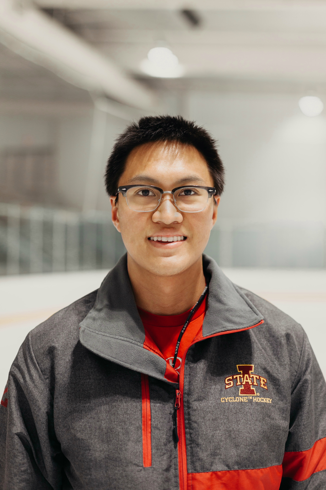

- __Name:__ Anthony Song

- __Major:__ Chemistry and Data Science
- __Research Experience:__ 

Spectroscopic Research Iowa State University
Mentors: Jacob W. Petrich (PhD), Mark A. Rasmussen (PhD), May 2017 - Current 
• Implementing a translation stage control interface, using LabView, for an Optical Heterodyning Detection system.
• Utilizing fluorescence and UV-Vis spectroscopy to study the degradation of chlorophyll metabolites.
• Investigating the quenching of fluorophores and molecular interactions of magnetic ionic liquids in biological systems. • Training new undergraduate lab 
members in fluorescence and absorption instrumentation and analysis.

Radiation Oncology Research University of Minnesota Medical School
Mentors: Chris Wilke (MD/PhD), Eric Ehler (PhD), Clark Chen (MD/PhD), June 2019 – Current
• Applying machine learning models to identify relationships in glioblastoma gene expression and clinical datasets.
• Extracting radiological imaging features for the detection of outliers in HDR Brachytherapy treatment plans using machine learning.
• Designing and 3D printing custom applicators to accurately and efficiently deliver radiotherapy dosages to mice.
• Gaining clinical experience in the radiation oncology unit by interacting with patients and shadowing physicians.

Department of Energy Undergraduate Research Fellow Ames Laboratory
Mentor: Jacob W. Petrich (PhD), January 2020 – May 2020
• Programmed a virtual Spontaneous Parametric Down Conversion optical system model simulation to detect entangled photons using Python.

- __Publications:__ 

1.) Santra, K., Song, A., Petrich, J. W., & Rasmussen, M. A. (2020). The Degradation of Chlorophyll Pigments in Dairy Silage: The Timeline of Anaerobic Fermentation. Journal of the Science of Food and Agriculture. https://doi.org/10.1002/jsfa.10917 (in press)

2.) Bower, A. N., Santra, K., Trujillo-Rodríguez, M. J., Song, A., Emaus, M. N., Petrich, J. W., & Anderson, J. L. (2020). Fluorescence quenching of the SYBR Green I-dsDNA complex by in situ generated magnetic ionic liquids. Analytical and Bioanalytical Chemistry, 412(12), 2743–2754. https://doi.org/10.1007/s00216-020-02538-3 (in press)

- __Leadership:__ 

Iowa State Women’s D2 Hockey Coach Iowa State University
Head Coach, August 2018 – Current
• Formulating and implementing on and off-ice systems to optimize performance and opportunities to win competitions.
• Developing the team mentally and physically to become successful as individuals and players.
• Leading by example to gain trust and respect from the players and staff.

Undergraduate Research Ambassador and Academic Success Center Tutor Iowa State University
Speaker and Tutor, March 2018 – Current
• Serving as a liaison for students interested in getting engaged in research.
• Planning, leading, and organizing tutoring sessions in Organic Chemistry, Physics and Computer Science.
• Speaking at campus organizations, classes, and major university events about undergraduate research initiatives.

Adaptive Sports Iowa Paralympic Sled Hockey Coach Ames, Iowa
Volunteer Head Coach and Coordinator, November 2018 - Current
• Coaching and leading ice sessions as well as connecting with individuals with disabilities.
• Working with members of Adaptive Sports Iowa to promote and improve Special Olympic sports exposure.

- __Research Interests:__ I am interested in integrating spectroscopic methods and machine learning models to study the detection and classification of cancer biomarkers. 

- __Contact:__ aasong@iastate.edu

